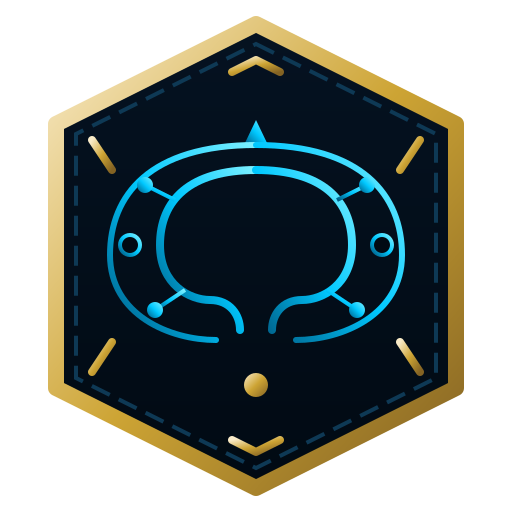

<div align="center">
  
  <h1>🏆 League MBTI Analytics</h1>
  <p><strong>What does your League of Legends playstyle say about you? Discover your Gamer Archetype.</strong></p>
  <p>
    <a href="#-features">Features</a> •
    <a href="#-how-we-calculate-it">How it Works</a> •
    <a href="#-quick-start">Quick Start</a> •
    <a href="#-tech-stack">Tech Stack</a>
  </p>
</div>

---

## 🎮 What is League MBTI Analytics?

**League MBTI Analytics** is a premium, interactive player personality analysis platform inspired by Spotify Wrapped. Instead of looking at boring, raw tables of statistics, we turn your in-game performance data into a rich, personalized story of growth, triumphs, and gameplay psychology.

By entering your Riot ID (e.g., `Hide on bush#KR1` or your local account), the app aggregates your matches, analyzes your psychological tendencies in battle, and maps your playstyle directly to a specialized gamer **MBTI archetype**.

---

## ✨ Features

- 🧠 **Dynamic MBTI Profiling:** A personalized personality diagnosis (e.g., INTJ, ESFP) tailored around real gameplay performance metrics.
- 📈 **Stunning Visual Analytics:** Interactive growth charts, champion frequency graphs, and playstyle trackers powered by **Recharts**.
- 🎭 **AI-Powered Storytelling:** Personalized narratives detailing your **Playstyle Evolution**, your **Standout Highlights**, and custom **2026 Season Predictions**.
- 🃏 **Share Cards:** Easily generate social-media-ready canvas cards showing off your Gamer Archetype and stats to share on Reddit, Twitter/X, or Discord.
- 🕹️ **Mock Data Mode:** Want to test it instantly without a Riot API key? Just check "Use Mock Data" on the landing page to load a high-fidelity mock profile!

---

## 📊 How We Calculate It

Our custom MBTI gameplay algorithm evaluates 8 distinct gameplay dimensions using normalized z-scores:

*   **E vs I (Extroverted vs Introverted):** Do you act as the collaborative core of the team (high assists, teamfight setup, vision)? Or are you a lethal lone wolf (high kills, solo lane splitpushing, raw carry damage)?
*   **S vs N (Sensing vs Intuitive):** Are you a consistent, safe strategist (highly stable KDA, ultra-low death averages)? Or are you a high-risk, high-reward playmaker who plays on the edge of the blade?
*   **T vs F (Thinking vs Feeling):** Do you prioritize cold, analytical efficiency (maximizing gold-to-damage conversion)? Or do you play for the team's utility (crowd control, healing, protective vision control)?
*   **J vs P (Judging vs Perceiving):** Are you a dedicated, disciplined specialist (narrow champion pool, lane consistency)? Or a highly flexible, chaotic generalist (wide champion pool, multi-role adapter)?

---

## 🚀 Quick Start

### 1. Clone & Install Dependencies
```bash
git clone https://github.com/yourusername/League-MBTI-Analysis.git
cd League-MBTI-Analysis
npm install
```

### 2. Configure Environment
Create a `.env` file in the root directory:
```env
RIOT_API_KEY=your_riot_developer_api_key
```
*(Get a free, instant developer key from the [Riot Developer Portal](https://developer.riotgames.com/))*

### 3. Run Locally
```bash
npm run dev
```
Open **[http://localhost:3000](http://localhost:3000)** in your browser and start analyzing!

---

## 🛠️ Tech Stack

- **Frontend:** React 19 + TypeScript + Vite + Tailwind CSS
- **Data Visuals:** Recharts (Premium League-themed charts)
- **Deployment & API Edge Routing:** Cloudflare Pages + Pages Functions (Wrangler)
- **Rendering:** Custom HTML5 Canvas 2D engine for instant shareable card generation

---

## 📄 License

This project is licensed under the MIT License.

*Disclaimer: League MBTI Analytics isn't endorsed by Riot Games and doesn't reflect the views or opinions of Riot Games or anyone officially involved in producing or managing League of Legends. League of Legends and Riot Games are trademarks or registered trademarks of Riot Games, Inc.*

---
<div align="center">
  Built for League of Legends players worldwide.
</div>
